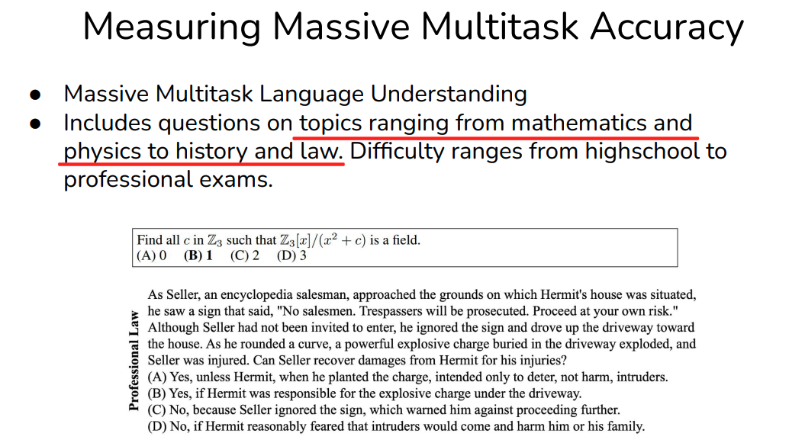
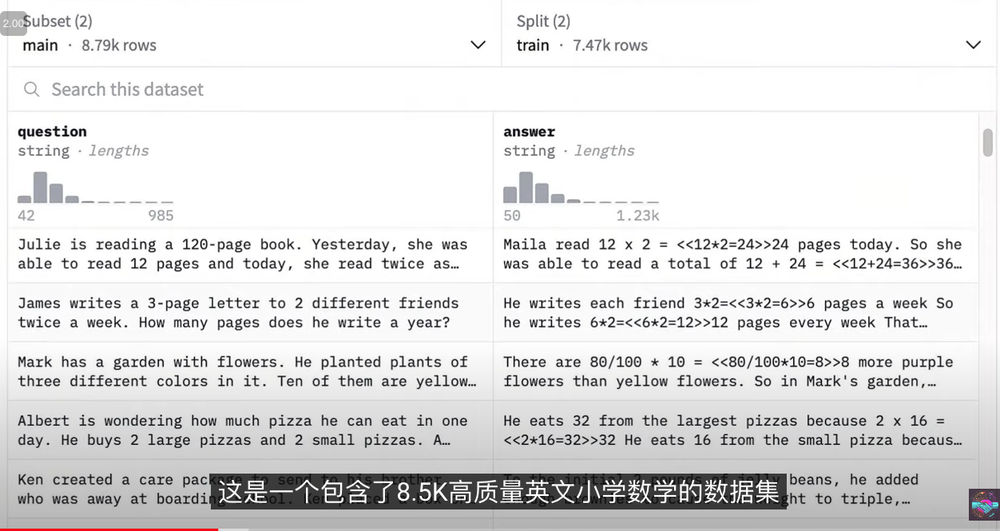
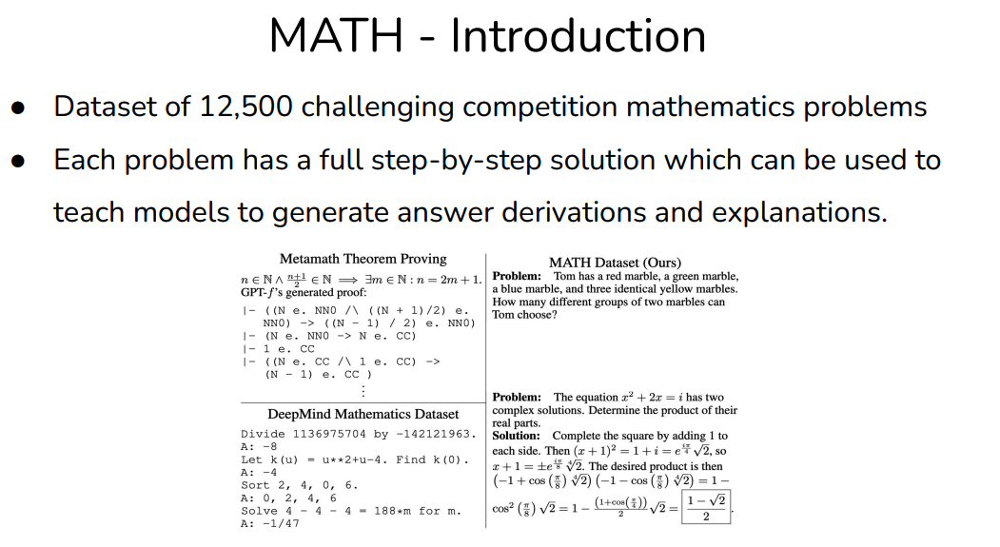
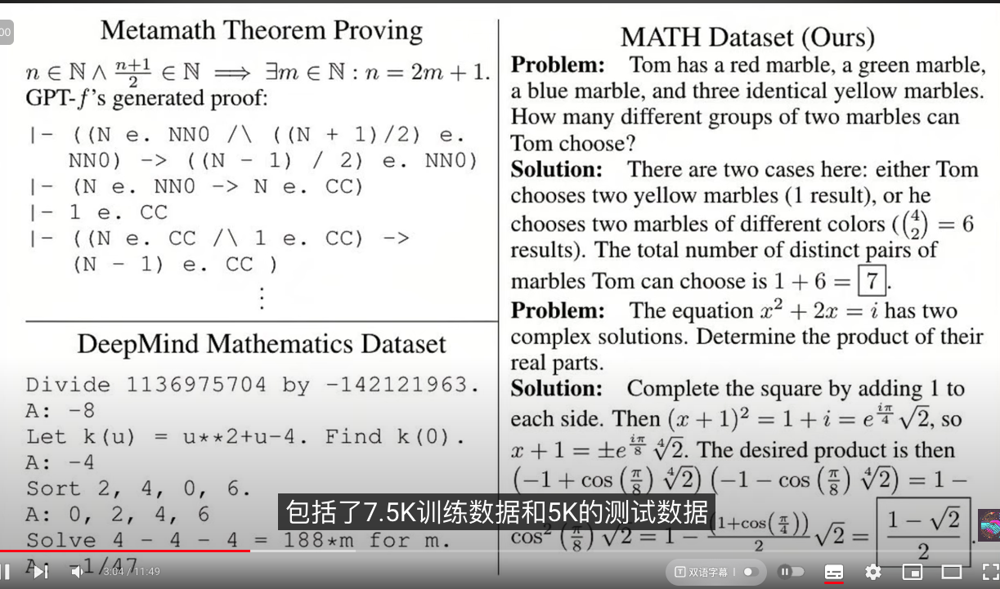

# 大模型评估数据集清单

Everybody relies on evaluation benchmarks ("evals") as they serve as incentives for the research community. Breakthroughs in performance are often closely tied to significant improvements on specific evals.


## GLUE

GLUE（General Language Understanding Evaluation）和 SuperGLUE 是自然语言处理领域的评估基准。在大语言模型出现之前，基本上所有的自然语言处理论文都会使用 GLUE/SuperGLUE，例如 BERT、T5 等模型。它们可以评估语言模型在不同自然语言处理任务上的性能。

GLUE tasks 主要包括 CoLA (Corpus of Linguistic Acceptability)、SST-2 (Stanford Sentiment Treebank)、MRPC (Microsoft Research Paraphrase Corpus)、QQP (Quora Question Pairs)、STS-B (Semantic Textual Similarity Benchmark)、MNLI (Multi-Genre Natural Language Inference)、QNLI (Question Natural Language Inference)、RTE (Recognizing Textual Entailment)、WNLI (Winograd NLI) 等。

SuperGLUE 是 GLUE 的升级版，包括更多的任务，例如 BoolQ、CB、COPA、MultiRC、ReCoRD、RTE、WiC、WSC 等。

给个具体的例子, GLUE 任务中的 CoLA 任务是一个二分类任务，目标是判断一个句子是否是语法正确的英语句子。该任务一个例子是：

```json
{
  "sentence": "The cat sat on the mat.",
  "label": 1
}
{
  "sentence": "On mat the sat cat.",
  "label": 0
}
```

CoLA 使用的评价指标是 Matthews correlation coefficient (MCC), 该指标的定义是：

$$
MCC = \frac{TP \times TN - FP \times FN}{\sqrt{(TP + FP)(TP + FN)(TN + FP)(TN + FN)}}
$$
其中:
- TP: True Positive, 预测为正类别的样本中，实际为正类别的样本数
- TN: True Negative, 预测为负类别的样本中，实际为负类别的样本数
- FP: False Positive, 预测为正类别的样本中，实际为负类别的样本数
- FN: False Negative, 预测为负类别的样本中，实际为正类别的样本数

MCC 的取值范围是 [-1, 1]，越接近 1 表示模型性能越好。


```
Task: Determine whether each of the following sentences is grammatically correct or incorrect.

Sentence 1: "The cat sat on the mat." -> grammatical
Sentence 2: "On mat the sat cat." -> ungrammatical

Now determine the correctness of the following sentence:

Sentence: "The dog ran fast across the field."
Answer:
```

CoLA 数据集的具体划分：train 8551, valid 1043, test 1064. 


## MMLU

MMLU（Massive Multitask Language Understanding）是一个被广泛应用于大语言模型评估的基准测试集。它涵盖了多个学科领域的问题，包括人文、社科、自然科学等，用于测试语言模型在各种知识领域的理解和回答能力。


比如对于某个具体的任务的一条具体的数据如下:

```json
{
  "question": "What is the capital of France?",
  "context": "France is a country in Europe. Its capital is Paris.",
  "answer": "Paris"
}
```





## GSM8K
GSM8K（Grade School Math 8K） spurred LLMs for reasoning, and is used in every paper on chain-of-thought. 数据集中包含 8,500 道数学题目（7,473 道训练集问题和 1,319 道测试集问题），每道题目都有详细的解答步骤和最终的正确答案。

```json
{
  "question": "If a car travels 100 miles in 2 hours, how many miles will it travel in 3 hours?",
  "answer": "150 miles",
  "solution": "The car travels 100 miles in 2 hours, so it travels 50 miles in 1 hour. Therefore, it will travel 150 miles in 3 hours."
}
```




## MATH

MATH is also used in most LLM papers.







## HumanEval

HumanEval 是一个用于评估大型语言模型在编程任务中的能力的数据集。这个数据集是由 OpenAI 发布的，专门用于测试模型在代码生成、理解、以及正确解答编程问题上的表现。 HumanEval 包含了 164 个编程任务。虽然任务数量不多，但这些任务的设计反映了现实中的编程挑战，涵盖了各种常见的计算问题、数据结构操作、字符串处理、递归问题等。

homepage: https://huggingface.co/datasets/openai/openai_humaneval

```json

{
    "task_id": "test/0",
    "prompt": "def return1():\n",
    "canonical_solution": "    return 1",
    "test": "def check(candidate):\n    assert candidate() == 1",
    "entry_point": "return1"
}
```

- task_id: 任务 ID
- prompt: input for the model containing function header and docstring
- canonical_solution: solution for the problem in the prompt
- test: contains fuction to test the candidate solution
- entry_point: function name to be called to test the candidate solution


## MT-Bench


MT-Bench 是一个针对多轮对话的基准评测集，专门用于评估大语言模型（LLMs）的对话能力。它由 Stanford Alpaca 团队 创建，旨在通过多轮对话场景测试模型在不同任务上的表现。MT-Bench 的全名是 Multi-Turn Benchmark，专注于模拟现实中的对话任务，测试模型的上下文保持能力、连贯性和信息整合能力。


在 MT-Bench 上使用gpt4 来评估是否准确. alpacaEval 同样也是一个 LLM as a Judge，用于评估模型在单轮对话任务上的性能。

MT-Bench 包含了 10 个不同的对话任务，涵盖了多轮对话、知识对话、情感对话、推理对话等多个领域。这些任务旨在测试模型在多轮对话场景中的表现，以及对话的连贯性、信息保持和推理能力。


## GPQA


GPQA (Graduate-Level Google-Proof Q&A Benchmark) 是一个专门设计用于评估大语言模型和可扩展监督机制的数据集。它包含 448 道高难度的多选题，主要涉及 生物学、物理学和化学 等领域。这些问题由领域专家精心设计，目标是测试语言模型在复杂和深奥问题上的推理和回答能力。

人类专家表现：即便是具有相关领域博士学位或正在攻读博士学位的专家，在该数据集上的平均正确率为 65%。而非专家，即使使用网络查找答案，正确率也只有 34%。

link: https://huggingface.co/datasets/Idavidrein/gpqa?row=5


Here is the correct breakdown of a data instance in GPQA:

- question: "Which of the following is the most common type of star in the universe?"
- choices: ["Red dwarf", "White dwarf", "Neutron star", "Black hole"]
- correct_answer: "Red dwarf"
- explanation: "Red dwarfs are the most common type of star in the universe. They are small, cool stars that are less than half the mass of the Sun. They are the most common type of star in the universe, making up about 70% of all stars."
- Expert and Non-Expert Validation: "The average correct rate of experts with a relevant Ph.D. or Ph.D. candidate is 65%, while non-experts, even with the help of the internet, have an average correct rate of 34%."


##  BIG-Bench 

BIG-Bench（Beyond the Imitation Game Benchmark）是一个用于测试大型语言模型（LLMs）能力的大规模基准测试集. 它包含了 10 个不同的任务，涵盖了自然语言理解、推理、生成、多语言任务等多个领域。BIG-Bench 旨在测试模型在各种任务上的性能，以及对模型的鲁棒性、伦理、偏见和真实性等方面的评估。

BIG-Bench Hard中的某些任务尽管具有挑战性，但其结果无法得出关于模型智能的有意义结论。BIG-bench 有特别多奇葩任务, 为难语言模型


