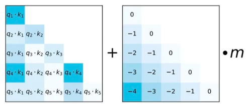
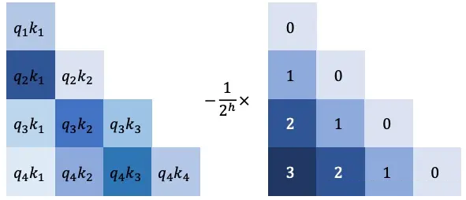

# 17.位置编码

### 1.位置编码

不同于RNN、CNN等模型，对于Transformer模型来说，位置编码的加入是必不可少的，因为**纯粹的Attention模块是无法捕捉输入顺序的，即无法区分不同位置的Token**。为此我们大体有两个选择：

1.  想办法将位置信息融入到输入中，这构成了绝对位置编码的一般做法；
2.  想办法微调一下Attention结构，使得它有能力分辨不同位置的Token，这构成了相对位置编码的一般做法。

#### 1.1 绝对位置编码

形式上来看，绝对位置编码是相对简单的一种方案，但即便如此，也不妨碍各路研究人员的奇思妙想，也有不少的变种。一般来说，绝对位置编码会加到输入中：在输入的第$k$个向量$x_k$中加入位置向量$p_k$变为$x_k+p_k$，其中$p_k$只依赖于位置编号$k$。

##### （1）训练式

直接**将位置编码当作可训练参数**，比如最大长度为512，编码维度为768，那么就初始化一个512×768的矩阵作为位置向量，让它随着训练过程更新。

对于这种训练式的绝对位置编码，一般的认为它的缺点是没有**外推性**，即如果预训练最大长度为512的话，那么最多就只能处理长度为512的句子，再长就处理不了了。当然，也可以将超过512的位置向量随机初始化，然后继续微调。但笔者最近的研究表明，通过层次分解的方式，可以使得绝对位置编码能外推到足够长的范围，同时保持还不错的效果，细节请参考笔者之前的博文[《层次分解位置编码，让BERT可以处理超长文本》](https://kexue.fm/archives/7947 "《层次分解位置编码，让BERT可以处理超长文本》")。因此，**其实外推性也不是绝对位置编码的明显缺点**。

##### （2）三角式

三角函数式位置编码，一般也称为Sinusoidal位置编码，是Google的论文[《Attention is All You Need》](https://arxiv.org/abs/1706.03762 "《Attention is All You Need》")所提出来的一个显式解：

$$
\left\{\begin{array}{l}\boldsymbol{p}_{k, 2 i}=\sin \left(k / 10000^{2 i / d}\right) \\ \boldsymbol{p}_{k, 2 i+1}=\cos \left(k / 10000^{2 i / d}\right)\end{array}\right.
$$

其中$p_{k,2i}$,$p_{k,2i+1}$分别是位置$k$的编码向量的第$2i$,$2i+1$个分量，$d$是位置向量的维度。

很明显，三角函数式位置编码的特点是**有显式的生成规律，因此可以期望于它有一定的外推性**。另外一个使用它的理由是：由于$\sin (\alpha+\beta)=\sin \alpha \cos \beta+\cos \alpha \sin \beta$以及$\cos (\alpha+\beta)=\cos \alpha \cos \beta-\sin \alpha \sin \beta$，这表明位置$\alpha+\beta$的向量可以表示成位置$\alpha$和位置$\beta$的向量组合，这提供了表达相对位置信息的可能性。但很奇怪的是，现在我们很少能看到直接使用这种形式的绝对位置编码的工作，原因不详。

##### （3）递归式

原则上来说，RNN模型不需要位置编码，它在结构上就自带了学习到位置信息的可能性（因为递归就意味着我们可以训练一个“数数”模型），因此，**如果在输入后面先接一层RNN，然后再接Transformer，那么理论上就不需要加位置编码了**。同理，我们也可以用RNN模型来学习一种绝对位置编码，比如从一个向量$p_0$出发，通过递归格式$p_{k+1}=f(p_k)$来得到各个位置的编码向量。

ICML 2020的论文[《Learning to Encode Position for Transformer with Continuous Dynamical Model》](https://arxiv.org/abs/2003.09229 "《Learning to Encode Position for Transformer with Continuous Dynamical Model》")把这个思想推到了极致，它**提出了用微分方程（ODE）**$dp_t/dt=h(p_t,t)$**的方式来建模位置编码**，该方案称之为FLOATER。显然，FLOATER也属于递归模型，函数$h(p_t,t)$可以通过神经网络来建模，因此这种微分方程也称为神经微分方程，关于它的工作最近也逐渐多了起来。

理论上来说，**基于递归模型的位置编码也具有比较好的外推性，同时它也比三角函数式的位置编码有更好的灵活性**（比如容易证明三角函数式的位置编码就是FLOATER的某个特解）。但是很明显，递归形式的位置编码牺牲了一定的并行性，可能会带速度瓶颈。

##### （4）相乘式

似乎将“加”换成“乘”，也就是$x_k\times p_k$的方式，似乎比$x_k+p_k$能取得更好的结果。具体效果笔者也没有完整对比过，只是提供这么一种可能性。关于实验来源，可以参考[《中文语言模型研究：(1) 乘性位置编码》](https://zhuanlan.zhihu.com/p/183234823 "《中文语言模型研究：(1) 乘性位置编码》")。

#### 1.2 相对位置编码

相对位置并没有完整建模每个输入的位置信息，而是在**算Attention的时候考虑当前位置与被Attention的位置的相对距离**，由于自然语言一般更依赖于相对位置，所以相对位置编码通常也有着优秀的表现。对于相对位置编码来说，它的灵活性更大，更加体现出了研究人员的“天马行空”。

##### （1）经典式

相对位置编码起源于Google的论文[《Self-Attention with Relative Position Representations》](https://arxiv.org/abs/1803.02155 "《Self-Attention with Relative Position Representations》")，华为开源的NEZHA模型也用到了这种位置编码，后面各种相对位置编码变体基本也是依葫芦画瓢的简单修改。

一般认为，**相对位置编码是由绝对位置编码启发而来**，考虑一般的带绝对位置编码的Attention：

$$
\left\{\begin{aligned} \boldsymbol{q}_{i} & =\left(\boldsymbol{x}_{i}+\boldsymbol{p}_{i}\right) \boldsymbol{W}_{Q} \\ \boldsymbol{k}_{j} & =\left(\boldsymbol{x}_{j}+\boldsymbol{p}_{j}\right) \boldsymbol{W}_{K} \\ \boldsymbol{v}_{j} & =\left(\boldsymbol{x}_{j}+\boldsymbol{p}_{j}\right) \boldsymbol{W}_{V} \\ a_{i, j} & =\operatorname{softmax}\left(\boldsymbol{q}_{i} \boldsymbol{k}_{j}^{\top}\right) \\ \boldsymbol{o}_{i} & =\sum_{j} a_{i, j} \boldsymbol{v}_{j}\end{aligned}\right.
$$

其中`softmax`对j那一维归一化，这里的向量都是指行向量。我们初步展开$q_ik^T_j$：

$$
\boldsymbol{q}_{i} \boldsymbol{k}_{j}^{\top}=\left(\boldsymbol{x}_{i}+\boldsymbol{p}_{i}\right) \boldsymbol{W}_{Q} \boldsymbol{W}_{K}^{\top}\left(\boldsymbol{x}_{j}+\boldsymbol{p}_{j}\right)^{\top}=\left(\boldsymbol{x}_{i} \boldsymbol{W}_{Q}+\boldsymbol{p}_{i} \boldsymbol{W}_{Q}\right)\left(\boldsymbol{W}_{K}^{\top} \boldsymbol{x}_{j}^{\top}+\boldsymbol{W}_{K}^{\top} \boldsymbol{p}_{j}^{\top}\right)
$$

为了引入相对位置信息，Google把第一项位置去掉，第二项$p_jW_K$改为二元位置向量$R^K_{i,j}$，变成

$$
a_{i, j}=\operatorname{softmax}\left(\boldsymbol{x}_{i} \boldsymbol{W}_{Q}\left(\boldsymbol{x}_{j} \boldsymbol{W}_{K}+\boldsymbol{R}_{i, j}^{K}\right)^{\top}\right)
$$

以及$\boldsymbol{o}_{i}=\sum_{j} a_{i, j} \boldsymbol{v}_{j}=\sum_{j} a_{i, j}\left(\boldsymbol{x}_{j} \boldsymbol{W}_{V}+\boldsymbol{p}_{j} \boldsymbol{W}_{V}\right)$中的中的$p_jW_V$换成$R^V_{i,j}$：

$$
\boldsymbol{o}_{i}=\sum_{j} a_{i, j}\left(\boldsymbol{x}_{j} \boldsymbol{W}_{V}+\boldsymbol{R}_{i, j}^{V}\right)
$$

所谓相对位置，是将本来依赖于二元坐标$(i,j)$的向量$R^K_{i,j}$,$R^V_{i,j}$，改为只依赖于相对距离$i−j$，并且通常来说会进行截断，以适应不同任意的距离:

$$
\begin{array}{l}\boldsymbol{R}_{i, j}^{K}=\boldsymbol{p}_{K}\left[\operatorname{clip}\left(i-j, p_{\min }, p_{\max }\right)\right] \\ \boldsymbol{R}_{i, j}^{V}=\boldsymbol{p}_{V}\left[\operatorname{clip}\left(i-j, p_{\min }, p_{\max }\right)\right]\end{array}
$$

这样一来，只需要有限个位置编码，就可以表达出任意长度的相对位置（因为进行了截断），不管$p_K$,$p_V$是选择可训练式的还是三角函数式的，都可以达到处理任意长度文本的需求。

##### （2）XLNET式

XLNET式位置编码其实源自Transformer-XL的论文[《Transformer-XL: Attentive Language Models Beyond a Fixed-Length Context》](https://arxiv.org/abs/1901.02860 "《Transformer-XL: Attentive Language Models Beyond a Fixed-Length Context》")，只不过因为使用了Transformer-XL架构的[XLNET](https://arxiv.org/abs/1906.08237 "XLNET")模型并在一定程度上超过了BERT后，Transformer-XL才算广为人知，因此这种位置编码通常也被冠以XLNET之名。

XLNET式位置编码源于对上述$q_ik^T_j$的完全展开：

$$
\boldsymbol{q}_{i} \boldsymbol{k}_{j}^{\top}=\boldsymbol{x}_{i} \boldsymbol{W}_{Q} \boldsymbol{W}_{K}^{\top} \boldsymbol{x}_{j}^{\top}+\boldsymbol{x}_{i} \boldsymbol{W}_{Q} \boldsymbol{W}_{K}^{\top} \boldsymbol{p}_{j}^{\top}+\boldsymbol{p}_{i} \boldsymbol{W}_{Q} \boldsymbol{W}_{K}^{\top} \boldsymbol{x}_{j}^{\top}+\boldsymbol{p}_{i} \boldsymbol{W}_{Q} \boldsymbol{W}_{K}^{\top} \boldsymbol{p}_{j}^{\top}
$$

Transformer-XL的做法很简单，直接将$p_j$替换为相对位置向量$R_{i−j}$，至于两个$p_i$，则干脆替换为两个可训练的向量$u,v$：

$$
\boldsymbol{x}_{i} \boldsymbol{W}_{Q} \boldsymbol{W}_{K}^{\top} \boldsymbol{x}_{j}^{\top}+\boldsymbol{x}_{i} \boldsymbol{W}_{Q} \boldsymbol{W}_{K}^{\top} \boldsymbol{R}_{i-j}^{\top}+u \boldsymbol{W}_{Q} \boldsymbol{W}_{K}^{\top} \boldsymbol{x}_{j}^{\top}+\boldsymbol{v} \boldsymbol{W}_{Q} \boldsymbol{W}_{K}^{\top} \boldsymbol{R}_{i-j}^{\top}
$$

该编码方式中的$R_{i−j}$没有像经典模型那样进行截断，而是直接用了Sinusoidal式的生成方案，由于$R_{i−j}$的编码空间与$x_j$不一定相同，所以$R_{i−j}$前面的$W^T_K$换了另一个独立的矩阵$W^T_{K,R}$，还有$uW_Q$ 、$vW_Q$可以直接合并为单个$u$ 、$v$，所以最终使用的式子是：

$$
\boldsymbol{x}_{i} \boldsymbol{W}_{Q} \boldsymbol{W}_{K}^{\top} \boldsymbol{x}_{j}^{\top}+\boldsymbol{x}_{i} \boldsymbol{W}_{Q} \boldsymbol{W}_{K, R}^{\top} \boldsymbol{R}_{i-j}^{\top}+\boldsymbol{u} \boldsymbol{W}_{K}^{\top} \boldsymbol{x}_{j}^{\top}+\boldsymbol{v} \boldsymbol{W}_{K, R}^{\top} \boldsymbol{R}_{i-j}^{\top}
$$

此外，$v_j$上的位置偏置就直接去掉了，即直接令$\boldsymbol{o}_{i}=\sum_{j} a_{i, j} \boldsymbol{x}_{j} \boldsymbol{W}_{V}$。似乎从这个工作开始，后面的相对位置编码都只加到Attention矩阵上去，而不加到$v_j$上去了。

##### （3）T5式

T5模型出自文章[《Exploring the Limits of Transfer Learning with a Unified Text-to-Text Transformer》](https://arxiv.org/abs/1910.10683 "《Exploring the Limits of Transfer Learning with a Unified Text-to-Text Transformer》")，里边用到了一种更简单的相对位置编码。思路依然源自$q_ik^T_j$展开式，如果非要分析每一项的含义，那么可以分别理解为“输入-输入”、“输入-位置”、“位置-输入”、“位置-位置”四项注意力的组合。如果我们认为输入信息与位置信息应该是独立（解耦）的，那么它们就不应该有过多的交互，所以“输入-位置”、“位置-输入”两项Attention可以删掉，而$\boldsymbol{p}_{i} \boldsymbol{W}_{Q} \boldsymbol{W}_{K}^{\top} \boldsymbol{p}_{j}^{\top}$实际上只是一个只依赖于$(i,j)$的标量，我们可以直接将它作为参数训练出来，即简化为：

$$
\boldsymbol{x}_{i} \boldsymbol{W}_{Q} \boldsymbol{W}_{K}^{\top} \boldsymbol{x}_{j}^{\top}+\boldsymbol{\beta}_{i, j}
$$

说白了，它仅仅是在Attention矩阵的基础上加一个可训练的偏置项而已，而跟XLNET式一样，在$v_j$上的位置偏置则直接被去掉了。包含同样的思想的还有微软在ICLR 2021的论文[《Rethinking Positional Encoding in Language Pre-training》](https://arxiv.org/abs/2006.15595 "《Rethinking Positional Encoding in Language Pre-training》")中提出的TUPE位置编码。

比较“别致”的是，不同于常规位置编码对将$\beta_{i, j}$视为$i−j$的函数并进行截断的做法，T5对相对位置进行了一个“分桶”处理，即相对位置是$i−j$的位置实际上对应的是$f(i−j)$位置，映射关系如下： &#x20;

| $i-j$    | 0  | 1  | 2  | 3  | 4  | 5  | 6  | 7  | 8  | 9  | 10 | 11 | 12 | 13 | 14 | 15  |
| -------- | -- | -- | -- | -- | -- | -- | -- | -- | -- | -- | -- | -- | -- | -- | -- | --- |
| $f(i-j)$ | 0  | 1  | 2  | 3  | 4  | 5  | 6  | 7  | 8  | 8  | 8  | 8  | 9  | 9  | 9  | 9   |
| $i-j$    | 16 | 17 | 18 | 19 | 20 | 21 | 22 | 23 | 24 | 25 | 26 | 27 | 28 | 29 | 30 | ... |
| $f(i-j)$ | 10 | 10 | 10 | 10 | 10 | 10 | 10 | 11 | 11 | 11 | 11 | 11 | 11 | 11 | 11 | ... |

这个设计的思路其实也很直观，就是比较邻近的位置（0～7），需要比较得精细一些，所以给它们都分配一个独立的位置编码，至于稍远的位置（比如8～11），我们不用区分得太清楚，所以它们可以共用一个位置编码，距离越远，共用的范围就可以越大，直到达到指定范围再clip。

##### （4）DeBERTa式

DeBERTa也是微软搞的，去年6月就发出来了，论文为[《DeBERTa: Decoding-enhanced BERT with Disentangled Attention》](https://arxiv.org/abs/2006.03654 "《DeBERTa: Decoding-enhanced BERT with Disentangled Attention》")，最近又小小地火了一把，一是因为它正式中了ICLR 2021，二则是它登上[SuperGLUE](https://super.gluebenchmark.com/ "SuperGLUE")的榜首，成绩稍微超过了T5。

其实DeBERTa的主要改进也是在位置编码上，同样还是从$q_ik^T_j$展开式出发，T5是干脆去掉了第2、3项，只保留第4项并替换为相对位置编码，而DeBERTa则刚刚相反，它扔掉了第4项，保留第2、3项并且替换为相对位置编码（果然，科研就是枚举所有的排列组合看哪个最优）：

$$
\boldsymbol{q}_{i} \boldsymbol{k}_{j}^{\top}=\boldsymbol{x}_{i} \boldsymbol{W}_{Q} \boldsymbol{W}_{K}^{\top} \boldsymbol{x}_{j}^{\top}+\boldsymbol{x}_{i} \boldsymbol{W}_{Q} \boldsymbol{W}_{K}^{\top} \boldsymbol{R}_{i, j}^{\top}+\boldsymbol{R}_{j, i} \boldsymbol{W}_{Q} \boldsymbol{W}_{K}^{\top} \boldsymbol{x}_{j}^{\top}
$$

不过，DeBERTa比较有意思的地方，是提供了使用相对位置和绝对位置编码的一个新视角，它指出NLP的大多数任务可能都只需要相对位置信息，但确实有些场景下绝对位置信息更有帮助，于是它将整个模型分为两部分来理解。以Base版的MLM预训练模型为例，它一共有13层，前11层只是用相对位置编码，这部分称为Encoder，后面2层加入绝对位置信息，这部分它称之为Decoder，还弄了个简称EMD（Enhanced Mask Decoder）；至于下游任务的微调截断，则是使用前11层的Encoder加上1层的Decoder来进行。

SuperGLUE上的成绩肯定了DeBERTa的价值，但是它论文的各种命名真的是让人觉得极度不适，比如它自称的“Encoder”、“Decoder”就很容易让人误解这是一个Seq2Seq模型，比如EMD这个简称也跟Earth Mover's Distance重名。虽然有时候重名是不可避免的，但它重的名都是ML界大家都比较熟悉的对象，相当容易引起误解，真不知道作者是怎么想的...

#### 1.3 其他位置编码

绝对位置编码和相对位置编码虽然花样百出，但仍然算是经典范围内，从上述介绍中我们依然可以体会到满满的套路感。除此之外，还有一些并不按照常规套路出牌，它们同样也表达了位置编码。

##### （1）CNN式

尽管经典的将CNN用于NLP的工作[《Convolutional Sequence to Sequence Learning》](https://arxiv.org/abs/1705.03122 "《Convolutional Sequence to Sequence Learning》")往里边加入了位置编码，但我们知道一般的CNN模型尤其是图像中的CNN模型，都是没有另外加位置编码的，那CNN模型究竟是怎么捕捉位置信息的呢？

如果让笔者来回答，那么答案可能是卷积核的各项异性导致了它能分辨出不同方向的相对位置。不过ICLR 2020的论文[《How Much Position Information Do Convolutional Neural Networks Encode?》](https://arxiv.org/abs/2001.08248 "《How Much Position Information Do Convolutional Neural Networks Encode?》")给出了一个可能让人比较意外的答案：**CNN模型的位置信息，是Zero Padding泄漏的！**

我们知道，为了使得卷积编码过程中的feature保持一定的大小，我们通常会对输入padding一定的0，而这篇论文显示该操作导致模型有能力识别位置信息。也就是说，卷积核的各向异性固然重要，但是最根本的是zero padding的存在，那么可以想象，实际上提取的是当前位置与padding的边界的相对距离。

不过，这个能力依赖于CNN的局部性，像Attention这种全局的无先验结构并不适用，

###### （2）复数式

复数式位置编码可谓是最特立独行的一种位置编码方案了，它来自ICLR 2020的论文[《Encoding word order in complex embeddings》](https://arxiv.org/abs/1912.12333 "《Encoding word order in complex embeddings》")。论文的主要思想是结合复数的性质以及一些基本原理，推导出了它的位置编码形式（Complex Order）为：

$$
\left[r_{j, 1} e^{\mathrm{i}\left(\omega_{j, 1} k+\theta_{j, 1}\right)}, \ldots, r_{j, 2} e^{\mathrm{i}\left(\omega_{j, 2} k+\theta_{j, 2}\right)}, \cdots, r_{j, d} e^{\mathrm{i}\left(\omega_{j, d} k+\theta_{j, d}\right)}\right]
$$

这里的i是虚数单位，j代表某个词，k代表该词所在的位置，而

$$
\begin{aligned} \boldsymbol{r}_{j} & =\left[r_{j, 1}, r_{j, 2}, \cdots, r_{j, d}\right] \\ \boldsymbol{\omega}_{j} & =\left[\omega_{j, 1}, \omega_{j, 2}, \cdots, \omega_{j, d}\right] \\ \boldsymbol{\theta}_{j} & =\left[\theta_{j, 1}, \theta_{j, 2}, \cdots, \theta_{j, d}\right]\end{aligned}
$$

代表词j的三组词向量。你没看错，它确实假设每个词有三组跟位置无关的词向量了（当然可以按照某种形式进行参数共享，使得它退化为两组甚至一组），然后跟位置k相关的词向量就按照上述公式运算。

你以为引入多组词向量就是它最特立独行的地方了？并不是！我们看到上式还是复数形式，你猜它接下来怎么着？将它实数化？非也，它是将它直接用于复数模型！也就是说，**它走的是一条复数模型路线，不仅仅输入的Embedding层是复数的，里边的每一层Transformer都是复数的**，它还实现和对比了复数版的Fasttext、LSTM、CNN等模型！这篇文章的一作是Benyou Wang，可以搜到他的相关工作基本上都是围绕着复数模型展开的，可谓复数模型的铁杆粉了～

###### （3）融合式（RoPE）

#### 1.4 总结

**绝对位置编码**

-   最原始的正余弦位置编码（即sinusoidal位置编码）是一种绝对位置编码，但从其原理中的正余弦的和差化积公式来看，引入的其实也是相对位置编码。
-   优势： 实现简单，可预先计算好，不用参与训练，速度快。
-   劣势： 没有外推性，即如果预训练最大长度为512的话，那么最多就只能处理长度为512的句子，再长就处理不了了。当然，也可以将超过512的位置向量随机初始化，然后继续微调。

**相对位置编码**

-   经典相对位置编码RPR式的讲解可看我的博客：相对位置编码之RPR式：《Self-Attention with Relative Position Representations》论文笔记 【在k, v中注入相对位置信息】
-   优势： 直接地体现了相对位置信号，效果更好。具有外推性，处理长文本能力更强。

**RoPE**

-   RoPE通过绝对位置编码的方式实现相对位置编码，综合了绝对位置编码和相对位置编码的优点。
-   主要就是**对attention中的q, k向量注入了绝对位置信息，然后用更新的q,k向量做attention中的内积就会引入相对位置信息了**。

### 2.旋转位置编码 RoPE篇

RoPE旋转位置编码是苏神提出来的一种相对位置编码，之前主要用在自研的语言模型roformer上，后续谷歌Palm和meta的LLaMA等都是采用此位置编码，通过复数形式来对于三角式绝对位置编码的改进。有一些同学可能没看懂苏神的公式推导，我这里来帮助大家推理理解下公式。

通过线性attention演算，现在q和k向量中引入绝对位置信息：

$$
\tilde{\boldsymbol{q}}_{m}=\boldsymbol{f}(\boldsymbol{q}, m), \quad \tilde{\boldsymbol{k}}_{n}=\boldsymbol{f}(\boldsymbol{k}, n)
$$

但是需要实现相对位置编码的话，需要显式融入相对。attention运算中q和k会进行内积，所以考虑在进行向量内积时考虑融入相对位置。所以假设成立恒等式：

$$
\langle\boldsymbol{f}(\boldsymbol{q}, m), \boldsymbol{f}(\boldsymbol{k}, n)\rangle=g(\boldsymbol{q}, \boldsymbol{k}, m-n)
$$

其中`m-n`包含着token之间的相对位置信息。

给上述恒等式计算设置初始条件，例如$f(q,0)=q$，$f(k,0)=k$。

求解过程使用复数方式求解

将内积使用复数形式表示：

$$
\langle\boldsymbol{q}, \boldsymbol{k}\rangle=\operatorname{Re}\left[\boldsymbol{q} \boldsymbol{k}^{*}\right]
$$

转化上面内积公式可得：

$$
\operatorname{Re}\left[\boldsymbol{f}(\boldsymbol{q}, m) \boldsymbol{f}^{*}(\boldsymbol{k}, n)\right]=g(\boldsymbol{q}, \boldsymbol{k}, m-n)
$$

假设等式两边都存在复数形式，则有下式：

$$
\boldsymbol{f}(\boldsymbol{q}, m) \boldsymbol{f}^{*}(\boldsymbol{k}, n)=\boldsymbol{g}(\boldsymbol{q}, \boldsymbol{k}, m-n)
$$

将两边公式皆用复数指数形式表示：

存在$r e^{\theta \mathrm{j}}=r \cos \theta+r \sin \theta \mathrm{j}$，即任意复数$z$可以表示为$\boldsymbol{z}=r e^{\theta \mathrm{j}}$，其中$r$为复数的模，$\theta$为幅角。

$$
\begin{aligned} \boldsymbol{f}(\boldsymbol{q}, m) & =R_{f}(\boldsymbol{q}, m) e^{\mathrm{i} \Theta_{f}(\boldsymbol{q}, m)} \\ \boldsymbol{f}(\boldsymbol{k}, n) & =R_{f}(\boldsymbol{k}, n) e^{\mathrm{i} \Theta_{f}(\boldsymbol{k}, n)} \\ \boldsymbol{g}(\boldsymbol{q}, \boldsymbol{k}, m-n) & =R_{g}(\boldsymbol{q}, \boldsymbol{k}, m-n) e^{\mathrm{i} \Theta_{g}(\boldsymbol{q}, \boldsymbol{k}, m-n)}\end{aligned}
$$

由于带入上面方程中$f(k,n)$带\*是共轭复数，所以指数形式应该是$e^{-x}$形式，带入上式公式可得方程组：

$$
\begin{aligned} R_{f}(\boldsymbol{q}, m) R_{f}(\boldsymbol{k}, n) & =R_{g}(\boldsymbol{q}, \boldsymbol{k}, m-n) \\ \Theta_{f}(\boldsymbol{q}, m)-\Theta_{f}(\boldsymbol{k}, n) & =\Theta_{g}(\boldsymbol{q}, \boldsymbol{k}, m-n)\end{aligned}
$$

第一个方程带入条件$m=n$化简可得：

$$
R_{f}(\boldsymbol{q}, m) R_{f}(\boldsymbol{k}, m)=R_{g}(\boldsymbol{q}, \boldsymbol{k}, 0)=R_{f}(\boldsymbol{q}, 0) R_{f}(\boldsymbol{k}, 0)=\|\boldsymbol{q}\|\|\boldsymbol{k}\|
$$

$$
R_{f}(\boldsymbol{q}, m)=\|\boldsymbol{q}\|, R_{f}(\boldsymbol{k}, m)=\|\boldsymbol{k}\|
$$

从上式可以看出来复数$f(q,m)$和$f(k,m)$与$m$取值关系不大。

第二个方程带入$m=n$化简可得：

$$
\Theta_{f}(\boldsymbol{q}, m)-\Theta_{f}(\boldsymbol{k}, m)=\Theta_{g}(\boldsymbol{q}, \boldsymbol{k}, 0)=\Theta_{f}(\boldsymbol{q}, 0)-\Theta_{f}(\boldsymbol{k}, 0)=\Theta(\boldsymbol{q})-\Theta(\boldsymbol{k})
$$

上式公式变量两边挪动下得到：

$$
\Theta_{f}(\boldsymbol{q}, m)-\Theta_{f}(\boldsymbol{k}, m)=\Theta_{g}(\boldsymbol{q}, \boldsymbol{k}, 0)=\Theta_{f}(\boldsymbol{q}, 0)-\Theta_{f}(\boldsymbol{k}, 0)=\Theta(\boldsymbol{q})-\Theta(\boldsymbol{k})
$$

其中上式结果相当于m是自变量，结果是与m相关的值，假设为 $\varphi(m)$，即$\Theta_{f}(\boldsymbol{q}, m)=\Theta(\boldsymbol{q})+\varphi(m)$

`n`假设为`m`的前一个token，则可得`n=m-1`，带入上上个式子可得：

$$
\varphi(m)-\varphi(m-1)=\Theta_{g}(\boldsymbol{q}, \boldsymbol{k}, 1)+\Theta(\boldsymbol{k})-\Theta(\boldsymbol{q})
$$

即 $\varphi(m)$是等差数列，假设等式右边为 $\theta$ ，则`m`和`m-1`位置的公差就是为$\theta$，可推得 $\varphi(m)=m \theta$。

得到二维情况下用复数表示的RoPE：

$$
\boldsymbol{f}(\boldsymbol{q}, m)=R_{f}(\boldsymbol{q}, m) e^{\mathrm{i} \Theta_{f}(\boldsymbol{q}, m)}=\|q\| e^{\mathrm{i}(\Theta(\boldsymbol{q})+m \theta)}=\boldsymbol{q} e^{\mathrm{i} m \theta}
$$

矩阵形式是：

$$
\boldsymbol{f}(\boldsymbol{q}, m)=\left(\begin{array}{cc}\cos m \theta & -\sin m \theta \\ \sin m \theta & \cos m \theta\end{array}\right)\left(\begin{array}{l}q_{0} \\ q_{1}\end{array}\right)
$$

公式最后还会采用三角式一样的远程衰减，来增加周期性函数外推位置差异性。

$$
\left(\boldsymbol{W}_{m} \boldsymbol{q}\right)^{\top}\left(\boldsymbol{W}_{n} \boldsymbol{k}\right)=\operatorname{Re}\left[\sum_{i=0}^{d / 2-1} \boldsymbol{q}_{[2 i: 2 i+1]} \boldsymbol{k}_{[2 i: 2 i+1]}^{*} e^{\mathrm{i}(m-n) \theta_{i}}\right]
$$

### 3.ALiBi (Attention with Linear Biases)篇

用处：可解决训练推理文本长度不一致，如论文中训练采用1024，推理采用2048。

思想：不直接输入position Embedding，然后$QK^T$计算时加入一个偏置，偏置其实就包含了Q和K的元素相对位置.

Alibi 的方法也算较为粗暴，是直接**作用在attention score中，给 attention score 加上一个预设好的偏置矩阵，相当于 q 和 k 相对位置差 1 就加上一个 -1 的偏置**。其实相当于假设两个 token 距离越远那么相互贡献也就越低。

其中**Alibi 位置编码是不需要通过训练的**，给定的预设矩阵中还会乘上`m`的调节因子，`m`的设置与attention的头数有关，是2的指数差值。论文中也做了尝试把m作为学习参数，但是并没有获得更好的效果。

Alibi 位置编码的**外推性比旋转位置编码外推性要好一些**，旋转位置编码也是基于正余弦三角式位置编码改进融入相对位置信息，但是正余弦三角式位置编码外推性缺点也很明显，看起来是不需要训练可以直接推演无限长度位置编码，但是忽略了一点就是周期性函数必须进行位置衰减，到远处的位置信息趋于直线震荡，基本很难有位置信息区分了，所以外推性比训练式的好不了多少，旋转位置编码基于此改进的自然也是如此。

Alibi 相当于在k和q向量内积上加入分数上的偏置，来体现出来位置差异性，针对于远距离衰减问题，则是通过softmax函数特性进行差异软放大，将token之间的位置差异性拉大，避免远距离时被衰减无限接近于0，因为直接作用在attention分数上，拉大远距离内积值，在训练的时候带来的位置差异性减少的问题会大大缓解，从而获得更远距离的外推性能。

### 4.长度外推问题篇

#### 4.1 什么是 长度外推问题？

大模型的外推性问题是指**大模型在训练时和预测时的输入长度不一致，导致模型的泛化能力下降的问题**。在目前的大模型中，一般指的是超出预训练设置的上下文长度时，依旧保持良好推理效果的能力。

长度外推性=train short, test long

**train short**：1）受限于训练成本；2）大部分文本的长度不会特别长，训练时的max\_length特别特别大其实意义不大（长尾）。

**test long**：这里long是指比训练时的max\_length长，希望不用微调就能在长文本上也有不错的效果。

#### 4.2 长度外推问题 的 解决方法 有哪些？

##### （1）进制表示

我们将整数n以一个三维向量\[a,b,c]来输入，a,b,c分别是n的百位、十位、个位。这样，我们既缩小了数字的跨度，又没有缩小相邻数字的差距，代价了增加了输入的维度——刚好，神经网络擅长处理高维数据。

如果想要进一步缩小数字的跨度，我们还可以进一步缩小进制的基数，如使用8进制、6进制甚至2进制，代价是进一步增加输入的维度。

##### （2）直接外推

简单来说，假如原来位置编码用三维向量表示，那外插就是直接增加一维。

可以提前预留多几维，训练阶段设为0，推理阶段直接改为其他数字，这就是外推（Extrapolation）。

然而，训练阶段预留的维度一直是0，如果推理阶段改为其他数字，效果不见得会好，因为模型对没被训练过的情况不一定具有适应能力。也就是说，**由于某些维度的训练数据不充分，所以直接进行外推通常会导致模型的性能严重下降**。

##### （3）线性插值

就是将2000以内压缩到1000以内，比如通过除以2，1749就变成了874.5，然后转为三维向量\[8,7,4.5]输入到原来的模型中。从绝对数值来看，新的\[7,4,9]实际上对应的是1498，是原本对应的2倍，映射方式不一致；从相对数值来看，原本相邻数字的差距为1，现在是0.5，最后一个维度更加“拥挤”。所以，做了内插修改后，通常都需要微调训练，以便模型重新适应拥挤的映射关系。

不过，内插方案也不尽完美，当处理范围进一步增大时，相邻差异则更小，并且这个相邻差异变小集中在个位数，剩下的百位、十位，还是保留了相邻差异为1。换句话说，**内插方法使得不同维度的分布情况不一样，每个维度变得不对等起来，模型进一步学习难度也更大**。

##### （4）进制转换

有没有不用新增维度，又能保持相邻差距的方案呢？**进制转换**！三个数字的10进制编码可以表示0～999，如果是16进制呢？它最大可以表示163−1=4095>1999。所以，只需要转到16进制，如1749变为\[6,13,5]，那么三维向量就可以覆盖目标范围，代价是每个维度的数字从0～9变为0～15。

这个进制转换的思想，实际上就对应着文章开头提到的NTK-aware scaled RoPE！

##### （5）总结

1.  直接外推的效果不大行；
2.  内插如果不微调，效果也很差；
3.  NTK-RoPE不微调就取得了非平凡（但有所下降）的外推结果；
4.  加入$logn$来集中注意力确实有帮助。

参考资料：

-   [https://spaces.ac.cn/archives/9675](https://spaces.ac.cn/archives/9675 "https://spaces.ac.cn/archives/9675")

#### 4.3 为了做到长度外推性，需要解决两个主要问题

1.  **预测时位置编码的外推**：没见过的就无法保证很好的泛化，不仅学习式位置编码如此；像正弦位置编码、RoPE也有这样的问题，它们自身虽然不用学习，但是会影响上层参数的学习；
2.  **预测时序列更长，导致注意力相比训练时更分散**：序列长度增大意味着attention分布的熵增大了，注意力更分散了；

#### 4.4 长度外推性的预测

可见，长度外推性问题并不完全与设计一个良好的位置编码等价。

然后，还有个问题是，虽然PE一直是transformer类模型中的重要的基础组件，很多位置编码也在尝试做一些外推性的工作，但整体来看早期的LLM其实没有特别关注或者说纠结长度外推性，直到后面各种NLG模型的崛起，尤其是ChatGPT的出现，大家才惊觉原来上下文可以做的这么长了？

为什么目前市面上的LLM鲜有使用呢（据目前所知，好像只有BLOOM/MPT/采用了ALiBi）？可能的原因：

1.  专注于长度外推性的工作主要是在21/22年后才逐渐出现，效果尚未经过充分检验；
2.  长度外推性的评测指标与LLM的评测指标并不完全match：目前长度外推性主要看PPL，这其实不够全面。PPL这类语言模型的指标，可能更关注局部上下文的预测，因此局部注意力相关的方案可能在这类评测上天然占优。
3.  目前的长度外推性工作似乎更多的在强调外推性如何如何，但更重要的应该还是max\_length内的效果，从LLM的角度来看，应该在保证max\_length内的效果后再去追求外推性。比如，从GLM的消融实验来看，ALiBi的效果还是不如RoPE的。

参考资料：

- [让研究人员绞尽脑汁的Transformer位置编码](https://kexue.fm/archives/8130 "让研究人员绞尽脑汁的Transformer位置编码")
- [Transformer升级之路：10、RoPE是一种β进制编码](https://spaces.ac.cn/archives/9675 "Transformer升级之路：10、RoPE是一种β进制编码")
- [开源LLM大模型位置编码探索](https://zhuanlan.zhihu.com/p/631003833 "开源LLM大模型位置编码探索")